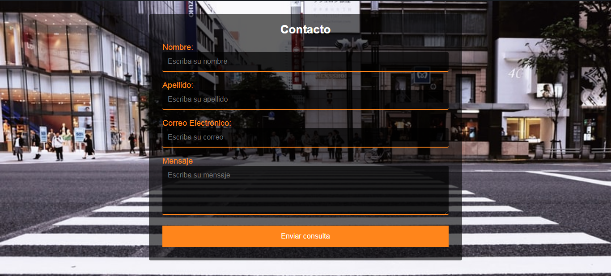

Formulario realizado con HTML, CSS y JS 🚀
===========
📋 Formulario realizado con HTML, CSS y JS
Incluye los campos de nombre, apellido, correo y mensaje
Campos validados con JS.

## Realizado con 🛠️
* HTML
* CSS
* JS

## Autores ✒️
* **Michel Hdez** - (https://github.com/MichelHdez)